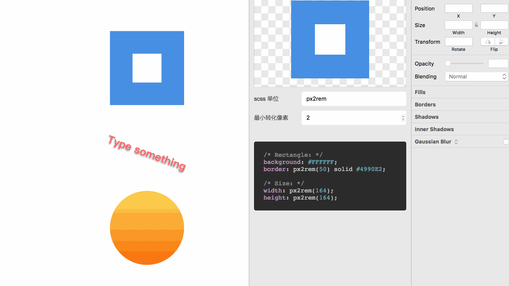

# SKFE

⭐️ SKFE is a Sketch plugin designed to save life of front-end engineer. Still in development stage~

### HOW TO USE
- Install plugin
- `Command` + `Alt` + `P`
- Select the layer
- Get the scss code ~:tada::tada::tada:

### DEMO

### URLS
- [How to create floating Sketch plugins, part I](https://awkward.co/blog/how-to-create-floating-sketch-plugins-i/)